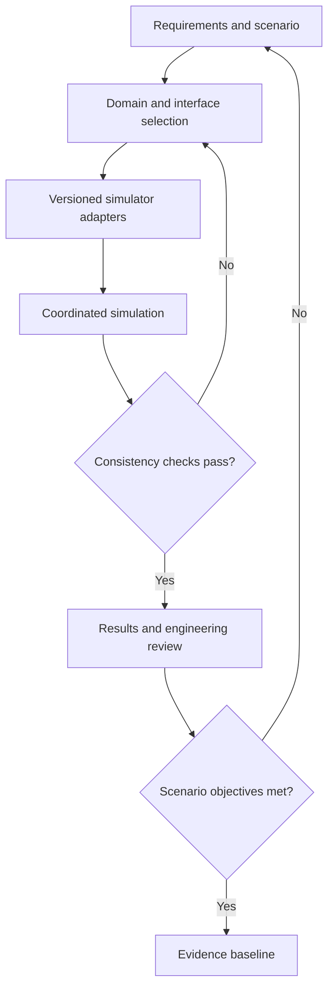
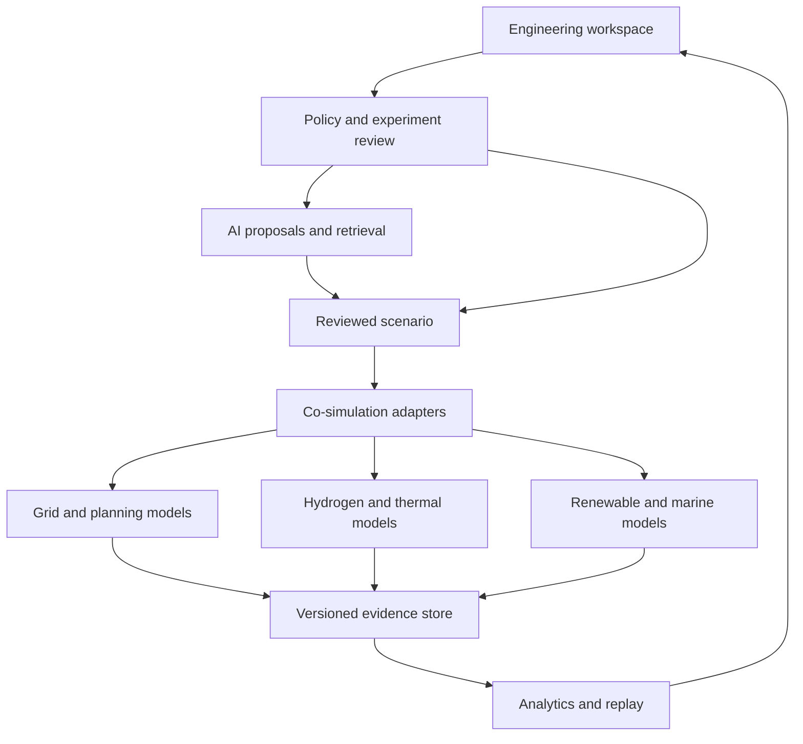
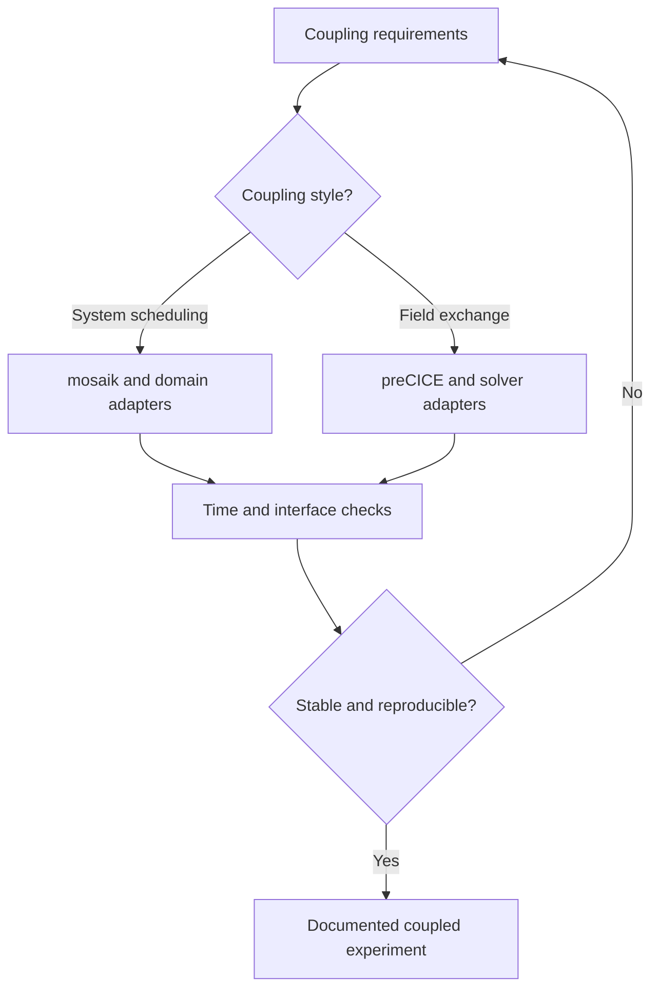
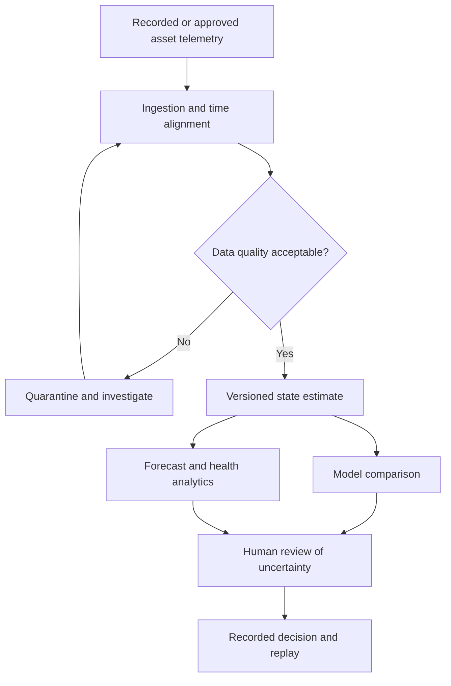
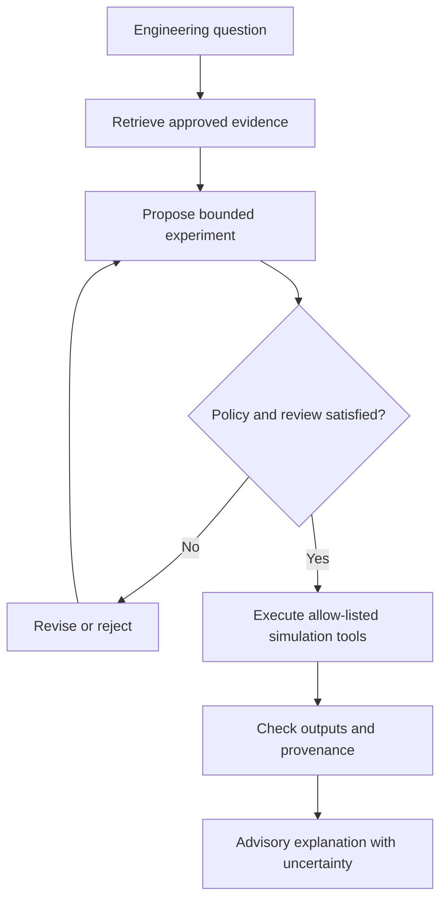
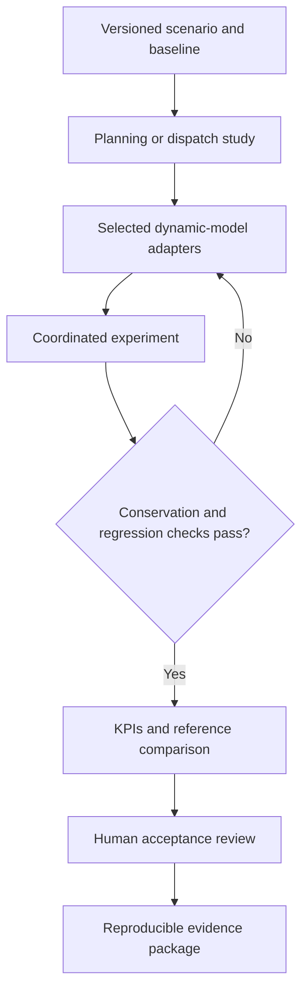
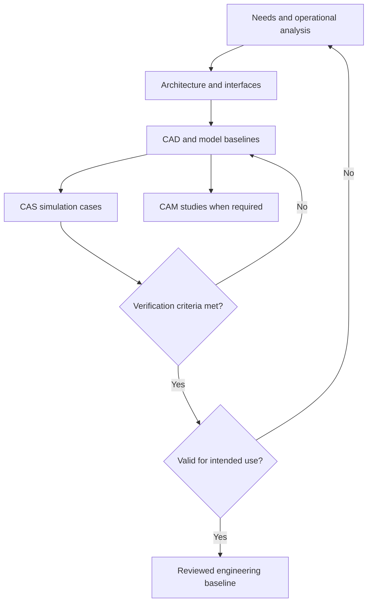
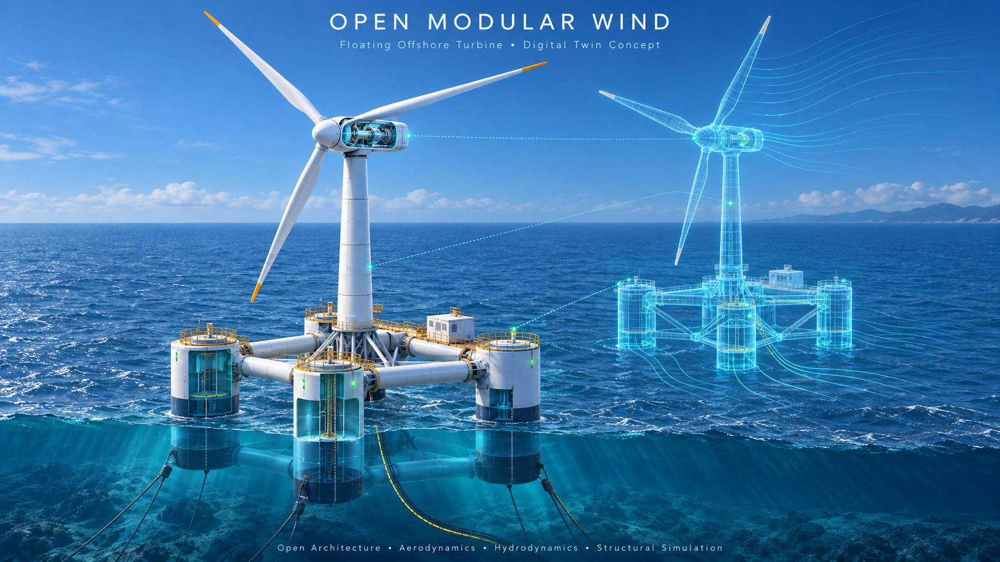
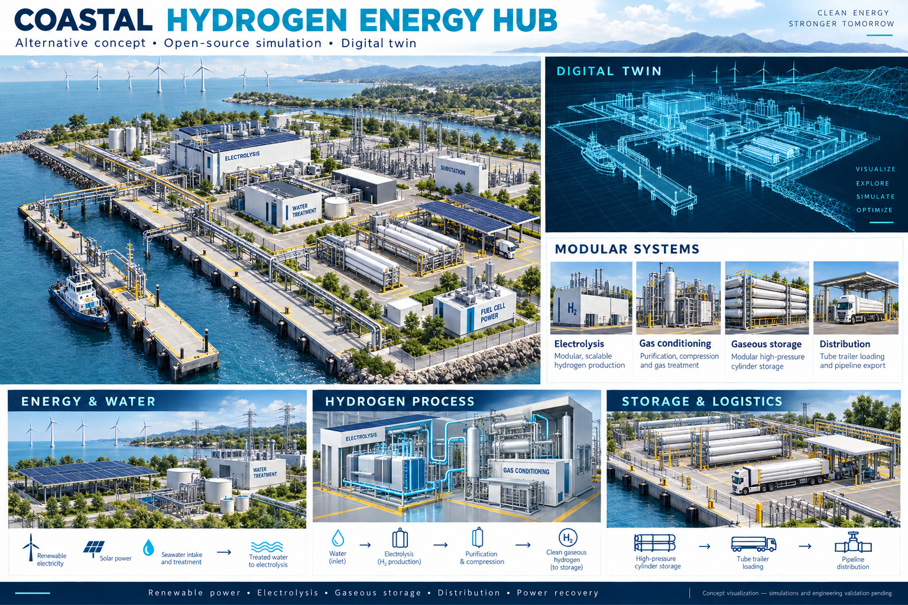
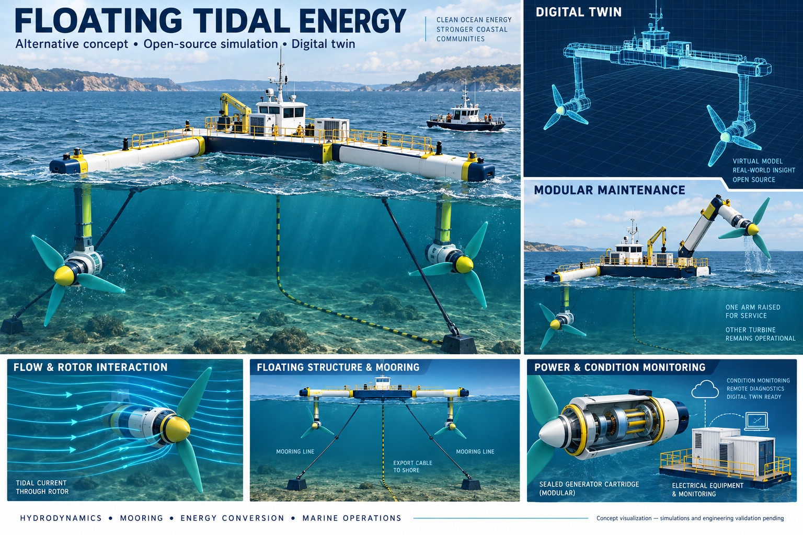

# JFXAI4MESS — Open-Source Alternative Integration Architecture

> **Project focus:** AI-Powered Multi-Energy System Simulation Platform
> **Architecture goal:** reorganize the alternatives listed in the JFXAI4MESS project description into a modular integration architecture for multi-energy simulation, power systems, hydrogen, thermal systems, hydropower, wind, photovoltaics, wave energy, floating offshore systems, co-simulation, optimization, digital twins, condition monitoring, and AI-assisted engineering.

**Current baseline:** documentation, three CAD concept boards and four Draw.io reference files. Executable adapters, solver interoperability and operational digital twins remain proposed. Numeric strategic scores below are editorial priorities, not measured benchmarks or verified maturity ratings.

---

## Contents

- [1. Source Project Direction](#1-source-project-direction)
- [2. Integration Principle](#2-integration-principle)
- [3. High-Level Alternative Integration Architecture](#3-high-level-alternative-integration-architecture)
- [4. Category A — Agent-Based Energy-System Control](#4-category-a--agent-based-energy-system-control)
- [5. Category B — Solar, Storage & Distributed Energy](#5-category-b--solar-storage--distributed-energy)
- [6. Category C — Hydrogen & Integrated Energy](#6-category-c--hydrogen--integrated-energy)
- [7. Category D — Green IT / Energy-Aware Computing](#7-category-d--green-it--energy-aware-computing)
- [8. Category E — Power-System Analysis](#8-category-e--power-system-analysis)
- [9. Category F — HIL & Smart Grid Co-Simulation](#9-category-f--hil--smart-grid-co-simulation)
- [10. Category G — System Optimization](#10-category-g--system-optimization)
- [11. Category H — Hydropower](#11-category-h--hydropower)
- [12. Category I — Thermal Systems](#12-category-i--thermal-systems)
- [13. Category J — Wind Turbine Dynamics](#13-category-j--wind-turbine-dynamics)
- [14. Category K — Wind Farm Simulation & Design](#14-category-k--wind-farm-simulation--design)
- [15. Category L — Floating Offshore Wind](#15-category-l--floating-offshore-wind)
- [16. Category M — Marine Hydrodynamics](#16-category-m--marine-hydrodynamics)
- [17. Category N — Wave Energy](#17-category-n--wave-energy)
- [18. Category O — Multiphysics Coupling](#18-category-o--multiphysics-coupling)
- [19. Category P — Nuclear / Advanced Reactor Research Reference](#19-category-p--nuclear--advanced-reactor-research-reference)
- [20. Category Q — Chemistry / Energy Agents](#20-category-q--chemistry--energy-agents)
- [21. Category R — Prognostics & Health Management](#21-category-r--prognostics--health-management)
- [22. Recommended Co-Simulation Backbone](#22-recommended-co-simulation-backbone)
- [23. Recommended Energy-System Solver Hierarchy](#23-recommended-energy-system-solver-hierarchy)
- [24. Multi-Energy Digital Twin Architecture](#24-multi-energy-digital-twin-architecture)
- [25. Proposed Complementary Open AI Layer](#25-proposed-complementary-open-ai-layer)
- [26. AI Engineering Copilot](#26-ai-engineering-copilot)
- [27. Model Routing Principle](#27-model-routing-principle)
- [28. Alternative Integration Profiles](#28-alternative-integration-profiles)
- [29. Strategic Priority](#29-strategic-priority)
- [30. Value Matrix](#30-value-matrix)
- [31. Recommended MVP](#31-recommended-mvp)
- [32. MVP Extension — Offshore Wind](#32-mvp-extension--offshore-wind)
- [33. MVP Extension — Asset Operations](#33-mvp-extension--asset-operations)
- [34. MBSE → CAD → CAM → CAS Mapping](#34-mbse--cad--cam--cas-mapping)
- [35. Suggested Repository Structure](#35-suggested-repository-structure)
- [36. Roadmap](#36-roadmap)
- [37. Final Strategic Architecture](#37-final-strategic-architecture)
- [38. Strategic Recommendation](#38-strategic-recommendation)
- [39. Source-List Classification Notes](#39-source-list-classification-notes)
- [40. Disclaimer](#40-disclaimer)
- [41. CAD Concept Catalogue and Existing Assets](#41-cad-concept-catalogue-and-existing-assets)

---

## 1. Source Project Direction

The source repository defines **JFXAI4MESS** as an:

> **AI-Powered Multi-Energy System Simulation Platform**

Its source list spans:

- agent-based control and simulation;
- solar and battery energy systems;
- hydrogen integration;
- green-IT energy simulation;
- Modelica-based renewable-energy libraries;
- floating offshore wind;
- open energy modelling;
- hydrodynamic and wave-structure simulation;
- wave-energy converters;
- wind-turbine and wind-farm simulation;
- power-system analysis;
- power-market / adequacy simulation;
- HIL interfaces;
- smart-grid co-simulation;
- electro-mechanical grid models;
- hydropower;
- thermal-hydraulic and thermal-cycle systems;
- photovoltaic and power-electronics models;
- integrated energy-system process models;
- optimization;
- multiphysics coupling;
- prognostics and health management.

The repository also preserves the engineering lifecycle:

**Reference sequence:** MBSE → CAD → CAM → CAS.

with Arcadia/Capella concepts for model-based systems engineering, CAD for design, CAM for manufacturing/assembly, and CAS for end-to-end simulation and performance analysis.

---

## 2. Integration Principle

The source alternatives should not be treated as one monolithic simulator. Reference tables list candidate roles; they do not establish executable dataflow or compatibility. Coupling requires explicit adapters and numerical validation.

A better architecture is a **federation of domain simulators connected through open co-simulation and data contracts**:



The central principle is:

> **Use specialized physics and energy-system simulators as authoritative computational services; use AI for orchestration, scenario generation, surrogate modelling, diagnostics, optimization assistance, and interpretation.**

---

## 3. High-Level Alternative Integration Architecture



---

## 4. Category A — Agent-Based Energy-System Control

### AgentLib

**Source role:** framework for development and execution of agents for control and simulation of energy systems.

#### Strategic value

**5/5 — Core AI/control orchestration candidate**

Recommended position:

| Reference element |
| --- |
| System Objective |
| AgentLib |
| Agent Policy / Coordination |
| Domain Simulator |
| Observed State / Reward / KPI |

Best uses:

- distributed energy-resource coordination;
- supervisory control;
- multi-agent energy simulations;
- optimization experiments;
- digital-twin control research.

#### Classification

**Primary Agent-Based Energy-System Framework**

---

## 5. Category B — Solar, Storage & Distributed Energy

### LibreSolar System Simulation

**Source role:** solar/storage system simulation.

#### Strategic value

**4/5 — Strong distributed-energy candidate**

Best for:

- photovoltaic systems;
- battery storage;
- DC microgrids;
- off-grid / hybrid systems;
- controller evaluation.

#### Classification

**Strategic Solar / Storage Simulation Component**

---

### Modelica Library for Photovoltaic Systems and Power Converters

#### Strategic value

**5/5 — Core Modelica PV/power-electronics candidate**

Recommended for:

- PV arrays;
- converters;
- inverter behaviour;
- dynamic grid interaction;
- control-system studies.

#### Classification

**Strategic PV + Converter Model Library**

---

## 6. Category C — Hydrogen & Integrated Energy

### H2Integrate

**Source role:** hydrogen integration.

#### Strategic value

**5/5 — Strategic hydrogen-system candidate**

Potential roles:

- hydrogen production;
- hydrogen storage;
- sector coupling;
- renewable-to-hydrogen analysis;
- integrated electricity/hydrogen scenarios.

#### Classification

**Primary Hydrogen Integration Candidate**

---

### HYBRID

**Source role:** collection of transient Modelica process models representing physical dynamics of integrated energy systems and processes.

#### Strategic value

**5/5 — Core integrated-energy dynamic-model candidate**

Best fit:

| Reference element |
| --- |
| Electricity |
| Thermal |
| Hydrogen / Process |
| HYBRID |
| Dynamic Integrated-Energy Simulation |

#### Classification

**Strategic Multi-Energy Modelica Backbone**

---

### OpenRESV

**Source role:** open-source Modelica-based library.

#### Strategic value

**4/5 — Modelica renewable-system candidate**

The source README does not provide enough detail to define its exact subsystem scope, so it should be integrated through generic Modelica/FMI contracts until its upstream model set is reviewed.

#### Classification

**Modelica Renewable-Energy Library Candidate**

---

## 7. Category D — Green IT / Energy-Aware Computing

### Hy4GreenIT Simulation Model

#### Strategic value

**4/5 — Specialized cross-domain energy/IT research component**

Potential architectural role:

- energy-aware computing;
- data-centre / IT load modelling;
- hydrogen-supported computing energy scenarios;
- energy-demand flexibility.

#### Classification

**Green-IT / Sector-Coupling Research Candidate**

Exact scope and upstream documentation should be verified before core adoption.

---

## 8. Category E — Power-System Analysis

### PyPSA

**Source role:** Python for Power System Analysis.

#### Strategic value

**5/5 — Core power-system planning/optimization candidate**

Recommended for:

- power flow;
- network expansion;
- generation/storage optimization;
- sector coupling;
- energy-system planning.

Architecture:

| Reference element |
| --- |
| Network + Demand + Generation |
| PyPSA |
| Optimization / Power Flow |
| Dispatch / Expansion Results |

#### Classification

**Primary Open Power-System Analysis Layer**

---

### Antares Simulator

**Source role:** open-source power-system simulator.

#### Strategic value

**5/5 — Strategic adequacy / market-system simulation candidate**

Best for:

- power-system adequacy;
- generation mix;
- market-like chronological simulations;
- interconnection studies;
- long-horizon scenarios.

#### Classification

**Strategic Power-System Scenario Simulator**

---

### Dynaωo

**Source role:** hybrid C++/Modelica open-source simulation suite.

#### Strategic value

**5/5 — High-value dynamic grid-simulation candidate**

Best fit:

- grid dynamics;
- transient behaviour;
- electromechanical studies;
- Modelica/C++ hybrid simulation.

#### Classification

**Primary Dynamic Power-System Candidate**

---

### PowerGrids

**Source role:** Modelica library for electro-mechanical modelling.

#### Strategic value

**5/5 — Strategic electromechanical grid library**

Best for:

- synchronous-machine dynamics;
- network electromechanics;
- dynamic grid studies;
- Modelica integration.

#### Classification

**Strategic Modelica Grid Component**

---

### HanserModelica

**Source role:** Modelica library applied to electrical engineering.

#### Strategic value

**4/5 — Supporting electrical-model library**

Useful as a complementary Modelica reference for educational and engineering electrical models.

---

## 9. Category F — HIL & Smart Grid Co-Simulation

### OpenDSS to Typhoon HIL Interface Library

**Source role:** interface between OpenDSS and Typhoon HIL.

#### Strategic value

**4/5 — High-value HIL integration candidate**

Recommended pattern:

| Reference element |
| --- |
| Distribution Grid Model |
| OpenDSS |
| Interface Layer |
| Typhoon HIL |
| Controller / Hardware Test |

Because Typhoon HIL is not an open-source platform, this interface should be treated as an **optional external HIL bridge**, not as part of the open-source core.

#### Classification

**Optional Commercial-HIL Adapter**

---

### mosaik

**Source role:** flexible Smart Grid co-simulation framework.

#### Strategic value

**5/5 — Core energy co-simulation candidate**

Recommended as one of the primary integration backbones.

| Reference element |
| --- |
| PyPSA |
| Dynaωo |
| Hydrogen Model |
| Thermal Model |
| AgentLib |
| mosaik |
| Integrated Smart-Grid Scenario |

#### Classification

**Primary Smart-Grid Co-Simulation Orchestrator**

---

## 10. Category G — System Optimization

### OSeMOSYS

**Source role:** full-fledged systems optimization model.

#### Strategic value

**5/5 — Core strategic planning candidate**

Best use:

- long-term capacity planning;
- energy-transition scenarios;
- technology portfolio optimization;
- policy/scenario comparison.

#### Classification

**Primary Long-Term Energy-System Optimization Layer**

Recommended separation:

| Reference element |
| --- |
| OSeMOSYS → long-horizon strategy |
| PyPSA    → network + dispatch/expansion |
| Antares  → chronological adequacy/scenario analysis |
| Dynaωo   → dynamic grid behaviour |

These tools are complementary rather than direct substitutes.

---

## 11. Category H — Hydropower

### OpenHPL

**Source role:** open-source hydropower library.

#### Strategic value

**5/5 — Core hydropower simulation candidate**

Best for:

- hydraulic waterways;
- turbines;
- hydro plant dynamics;
- Modelica-based energy-system coupling.

#### Classification

**Primary Hydropower Dynamic-Model Component**

---

## 12. Category I — Thermal Systems

### ThermoSysPro

**Source role:** component library for thermal hydraulics.

#### Strategic value

**5/5 — Core thermal-system simulation candidate**

Recommended for:

- thermal cycles;
- heat exchangers;
- pumps;
- fluid networks;
- thermal-hydraulic systems.

#### Classification

**Strategic Thermal-Hydraulic Model Library**

---

### ThermoCycle

**Source role:** dynamic modelling library for thermal systems.

#### Strategic value

**5/5 — Strong thermodynamic-cycle candidate**

Best for:

- Rankine-like cycles;
- heat recovery;
- thermal storage;
- waste-heat recovery;
- dynamic thermal processes.

#### Classification

**Strategic Thermal-Cycle Model Library**

---

## 13. Category J — Wind Turbine Dynamics

### OpenFAST

**Source role:** wind-turbine simulation tool.

#### Strategic value

**5/5 — Core wind-turbine simulation candidate**

Recommended for:

- aero-hydro-servo-elastic simulation;
- turbine structural response;
- control-system studies;
- offshore wind dynamics.

#### Classification

**Primary Wind-Turbine Physics Simulator**

---

### SHARPy

**Source role:** modular aeroelastic solver.

#### Strategic value

**5/5 — Strategic aeroelastic research candidate**

Best for:

- flexible structures;
- unsteady aerodynamics;
- aeroelasticity;
- advanced turbine/airfoil concepts.

#### Classification

**Advanced Aeroelastic Simulation Component**

---

## 14. Category K — Wind Farm Simulation & Design

### WindSE

**Source role:** FEniCS-backed wind-farm simulation package.

#### Strategic value

**5/5 — Core open wind-farm optimization candidate**

Best for:

- wind-farm flow;
- layout optimization;
- wake interaction;
- physics-driven farm design.

#### Classification

**Primary Wind-Farm Simulation/Optimization Candidate**

---

### WInc3D

**Source role:** integrated wind-farm simulation framework.

#### Strategic value

**4/5 — Alternative integrated wind-farm candidate**

Best positioned as a comparative/advanced simulation path alongside WindSE.

---

### Wind Plant Integrated System Design and Engineering Model

#### Strategic value

**5/5 — Systems engineering wind-plant candidate**

Recommended role:

- integrated plant design;
- balance-of-system studies;
- techno-engineering optimization;
- multidisciplinary wind-plant design.

#### Classification

**Strategic Wind-Plant System Design Component**

---

### OpenOA

**Source role:** wind-plant performance assessment framework.

#### Strategic value

**5/5 — Core operational analytics candidate**

Best for:

- operational assessment;
- energy-performance analysis;
- plant KPIs;
- production-loss diagnostics.

#### Classification

**Primary Wind-Plant Performance Analytics Layer**

---

## 15. Category L — Floating Offshore Wind

### Design Optimization of FOWT

**Source role:** floating offshore wind-turbine design optimization.

#### Strategic value

**5/5 — High-value offshore design research block**

Recommended integration:

| Reference element |
| --- |
| FOWT Geometry / Parameters |
| Hydrodynamics + Aeroelastic Models |
| Optimization |
| Candidate Floating Platform |

#### Classification

**Strategic FOWT Optimization Candidate**

---

### SOWFA + FAST + OpenFOAM for FOWT

The source list references a combination of SOWFA, FAST and OpenFOAM for floating offshore wind.

#### Strategic value

**5/5 — High-fidelity offshore wind research stack**

Recommended role:

- atmospheric/wake CFD;
- wind-turbine dynamics;
- coupled offshore behaviour;
- high-fidelity validation.

#### Classification

**Advanced Offshore Wind Simulation Profile**

---

## 16. Category M — Marine Hydrodynamics

### BEMRosetta

**Source role:** hydrodynamic-solvers integration/conversion tooling.

#### Strategic value

**5/5 — Strategic hydrodynamic interoperability candidate**

Best fit:

- hydrodynamic model interchange;
- BEM solver workflows;
- marine response analysis;
- offshore structures.

#### Classification

**Hydrodynamic Integration Layer**

---

### oc4-floatfoam

**Source role:** OpenFOAM case repository for wave–structure interaction simulations.

#### Strategic value

**5/5 — High-value CFD validation reference**

Best for:

- floating platform hydrodynamics;
- wave interaction;
- offshore validation;
- OpenFOAM-based research workflows.

#### Classification

**Strategic Wave–Structure CFD Validation Candidate**

---

## 17. Category N — Wave Energy

### Wave Energy Converter Simulator

#### Strategic value

**5/5 — Domain-specific renewable generation candidate**

Recommended role:

| Reference element |
| --- |
| Wave Climate |
| Hydrodynamic Model |
| WEC Dynamics |
| PTO / Control |
| Energy Output |

#### Classification

**Strategic Marine-Renewable Simulation Component**

The exact upstream project should be documented because the source README gives a descriptive name rather than a unique repository identifier.

---


### Marine Energy Extension — HECS, TEC, WEC and OTEC

JFXAI4MESS also includes an open, modular marine-energy profile for resource modelling, conversion-system simulation, co-simulation and digital-twin development. The concepts below can be represented with open Modelica/Python models, FMI/FMU interfaces, hydrodynamic solvers and reusable data contracts.

| Concept | Definition | Integration role |
|---|---|---|
| **HECS** | **Hydrokinetic Energy Conversion Systems**, covering submerged and kinetic water turbines. | Umbrella profile for marine-current energy converters, underwater turbine modules, power take-off, mooring, subsea collection and operational digital twins. |
| **TEC** | **Tidal Energy Converter** or **Tidal Stream Generator**. | Tidal-resource and current-flow simulation, turbine and generator models, array interaction, control, maintenance and grid/export studies. |
| **WEC** | **Wave Energy Converter**. | Wave-resource, hydrodynamic-response, power-take-off, survivability, control and performance modelling. This extends the existing wave-energy category. |
| **OTEC** | **Ocean Thermal Energy Conversion**. | Ocean temperature-gradient, heat-cycle, seawater-interface, auxiliary-load and dispatch studies for integrated marine-energy scenarios. |

Recommended integration boundary:

| Reference element |
| --- |
| Ocean Resource |
| HECS / TEC / WEC / OTEC Conversion Model |
| Generator, Thermal Cycle or Power-Take-Off |
| Power Conditioning and Marine Collector |
| Grid / Storage / Hydrogen / Desalination Scenario |
| Digital Twin, Forecasting and PHM |

These profiles remain modular: each converter can be simulated independently and then connected through FMI/FMU, Modelica, Python APIs, mosaik or preCICE where the coupling requires tighter multiphysics coordination.

## 18. Category O — Multiphysics Coupling

### preCICE

**Source role:** coupling library for partitioned multiphysics simulations.

#### Strategic value

**5/5 — Core multiphysics integration backbone**

Recommended for:

- fluid-structure interaction;
- thermal-fluid coupling;
- offshore wind;
- wave-structure interaction;
- cross-solver multiphysics.

Architecture:

| Reference element |
| --- |
| Solver A |
| ↕ |
| preCICE |
| Solver B |

Examples:

| Reference element |
| --- |
| OpenFOAM ↔ structural solver |
| CFD ↔ thermal solver |
| wave model ↔ floating structure |

#### Classification

**Primary Multiphysics Coupling Layer**

---

## 19. Category P — Nuclear / Advanced Reactor Research Reference

### Project Firefly — Community-Selected Advanced Small Reactor

The source README includes Project Firefly as a community-selected advanced small reactor project.

For JFXAI4MESS, it is best positioned at **high level** as an integrated-energy-system research reference rather than as a core implementation dependency.

Potential architecture role:

| Reference element |
| --- |
| Advanced Reactor Energy Source Model |
| Thermal / Power Conversion Model |
| Integrated Energy System |
| Grid / Hydrogen / Heat Scenarios |

#### Classification

**Research Reference / Integrated-Energy Scenario Candidate**

Any operational reactor design, licensing, safety analysis or detailed reactor-engineering work belongs to specialist nuclear engineering and regulatory processes outside this software architecture.

---

## 20. Category Q — Chemistry / Energy Agents

### NeqSim Community Agents

**Source role:** community agents around NeqSim.

#### Strategic value

**4/5 — Process/thermodynamic agent integration candidate**

Potential use:

- thermodynamic-property queries;
- process-fluid calculations;
- agent-driven engineering workflows;
- hydrogen / gas-process support.

#### Classification

**Thermodynamics / Process Agent Candidate**

---

## 21. Category R — Prognostics & Health Management

### Wind Turbine Prognostics and Health Management Library

#### Strategic value

**5/5 — Core asset-health / predictive-maintenance candidate**

Recommended pipeline:

| Reference element |
| --- |
| SCADA / Sensor Data |
| Feature / Condition Model |
| PHM |
| Fault / Degradation Estimate |
| Maintenance Recommendation |

#### Classification

**Strategic Wind Asset PHM Layer**

---

## 22. Recommended Co-Simulation Backbone

The proposed architecture evaluates **two complementary coupling styles**:



and for tightly coupled multiphysics:

Field-coupled experiments may connect fluid, structural and thermal solvers through purpose-built adapters. This is a separate coupling choice, not a mandatory stage after every system simulation.

This avoids forcing one coupling technology to solve every integration problem.

---

## 23. Recommended Energy-System Solver Hierarchy

| Reference element |
| --- |
| STRATEGIC PLANNING |
| OSeMOSYS |
| NETWORK / DISPATCH / EXPANSION |
| PyPSA |
| ADEQUACY / CHRONOLOGICAL SYSTEM |
| Antares Simulator |
| DYNAMIC GRID |
| Dynaωo + PowerGrids |
| DEVICE / ASSET DYNAMICS |
| OpenFAST / OpenHPL / ThermoSysPro / PV Modelica |
| HIGH-FIDELITY PHYSICS |
| OpenFOAM / SHARPy / WindSE / oc4-floatfoam |

This hierarchy lets JFXAI4MESS choose the appropriate fidelity instead of using high-cost simulation for every decision.

---

## 24. Multi-Energy Digital Twin Architecture



---

## 25. Proposed Complementary Open AI Layer

The following components are **proposed integrations**, not source-list dependencies:

| Component | Proposed role |
|---|---|
| LangGraph | Agent/workflow orchestration |
| MCP | Tool interoperability |
| FastAPI | Simulation/service APIs |
| Qdrant | RAG over engineering documents |
| PostgreSQL | Scenario/assets/metadata |
| TimescaleDB | Time-series engineering data |
| Open WebUI | Optional engineering AI portal |
| Ollama / llama.cpp | Local model runtime |
| vLLM | Private high-throughput inference |
| MLflow | Experiment/model tracking |
| OpenTelemetry | Distributed tracing |
| Prometheus / Grafana | Monitoring and dashboards |

Optional local/private reasoning models should sit behind a provider-neutral gateway rather than being hard-coded into simulation services.

---

## 26. AI Engineering Copilot



AI responsibilities:

- convert engineering questions into simulation scenarios;
- retrieve assumptions and model documentation;
- assemble simulation workflows;
- generate parameter sweeps;
- compare alternatives;
- explain model outputs;
- summarize trade-offs;
- assist anomaly/PHM investigations.

AI should not replace the numerical solver or independently certify engineering results.

---

## 27. Model Routing Principle

| Reference element |
| --- |
| Engineering Task |
| Task / Model Router |
| LLM / Agent   Optimization Model  Physics Solver |
| OSeMOSYS / PyPSA     Dynaωo/OpenFAST/ |
| OpenFOAM/etc. |

Examples:

- "Summarize why a scenario failed" → LLM/agent
- "Find lowest-cost energy mix" → OSeMOSYS / PyPSA
- "Evaluate turbine dynamics" → OpenFAST
- "Evaluate offshore wave interaction" → OpenFOAM / oc4-floatfoam
- "Estimate grid transient response" → Dynaωo
- "Coordinate multiple domains" → mosaik
- "Couple tightly interacting PDE solvers" → preCICE

---

## 28. Alternative Integration Profiles

### Profile A — Power-System Planning

| Reference element |
| --- |
| OSeMOSYS |
| PyPSA |
| Antares Simulator |
| Dynaωo |
| PowerGrids |

**Best for:** long-term planning through dynamic grid validation.

---

### Profile B — Hydrogen + Renewable Microgrid

| Reference element |
| --- |
| LibreSolar |
| PV Modelica |
| H2Integrate |
| HYBRID |
| mosaik |
| AgentLib |
| Optimization |

**Best for:** integrated electricity/storage/hydrogen systems.

---

### Profile C — Floating Offshore Wind

| Reference element |
| --- |
| Wind Plant Design Model |
| OpenFAST |
| BEMRosetta |
| oc4-floatfoam / OpenFOAM |
| preCICE |
| FOWT Optimization |

**Best for:** multidisciplinary floating-wind design and validation.

---

### Profile D — Wind Farm Digital Twin

| Reference element |
| --- |
| Operational Data |
| OpenOA |
| Wind Turbine PHM |
| OpenFAST / WindSE |
| Digital Twin |
| Maintenance / Optimization |

**Best for:** operations and asset-performance improvement.

---

### Profile E — Hydro + Thermal + Grid

| Reference element |
| --- |
| OpenHPL |
| ThermoSysPro / ThermoCycle |
| Dynaωo |
| mosaik |
| Integrated Dynamic Scenario |

**Best for:** hydro-thermal-grid interaction studies.

---

### Profile F — Fully Open Multi-Energy Research Stack

| Reference element |
| --- |
| Capella / MBSE |
| OSeMOSYS |
| PyPSA |
| mosaik |
| Dynaωo + PowerGrids |
| HYBRID / H2Integrate |
| OpenFAST / WindSE |
| OpenHPL |
| ThermoSysPro |
| preCICE where tightly coupled |
| OpenOA / PHM |
| AI Copilot / RAG |

---

## 29. Strategic Priority

### Priority 1 — Core Multi-Energy Backbone

- AgentLib
- PyPSA
- OSeMOSYS
- mosaik
- Dynaωo
- PowerGrids
- HYBRID
- preCICE

These are initial integration candidates; selection depends on the experiment and adapter evidence.

---

### Priority 2 — Renewable Asset Simulation

- OpenFAST
- WindSE
- OpenOA
- OpenHPL
- LibreSolar
- photovoltaic Modelica library
- ThermoSysPro
- ThermoCycle

---

### Priority 3 — Offshore / High-Fidelity

- BEMRosetta
- oc4-floatfoam
- SHARPy
- WInc3D
- FOWT optimization
- SOWFA/FAST/OpenFOAM profile
- Wave Energy Converter Simulator

---

### Priority 4 — Specialized / Experimental

- H2Integrate
- Hy4GreenIT
- NeqSim Community Agents
- Wind Turbine PHM
- OpenRESV
- HanserModelica

---

### Priority 5 — External / Verification Required

- OpenDSS → Typhoon HIL bridge: useful, but target HIL platform is commercial.
- Project Firefly: research/scenario reference; exact open-source implementation status should be verified.
- descriptive entries without unique upstream links should be validated before core inclusion.

---

## 30. Value Matrix

| Component | Domain | Strategic Value | Recommended Role |
|---|---|---:|---|
| AgentLib | Agents / Control | 5/5 | Agent orchestration |
| LibreSolar | Solar / Storage | 4/5 | DER simulation |
| H2Integrate | Hydrogen | 5/5 | H₂ integration |
| Hy4GreenIT | Green IT | 4/5 | Sector-coupling research |
| OpenRESV | Modelica Renewables | 4/5 | Renewable models |
| FOWT Optimization | Offshore Wind | 5/5 | Floating-wind optimization |
| Open Energy Modelling Framework | Energy Modelling | 5/5 | General modelling reference |
| BEMRosetta | Hydrodynamics | 5/5 | BEM interoperability |
| oc4-floatfoam | Offshore CFD | 5/5 | Wave-structure validation |
| WEC Simulator | Wave Energy | 5/5 | Marine renewable simulation |
| SOWFA/FAST/OpenFOAM | Offshore Wind | 5/5 | High-fidelity profile |
| NeqSim Agents | Thermodynamics | 4/5 | Process/thermodynamic agent |
| PyPSA | Power Systems | 5/5 | Network planning/optimization |
| Antares | Power Systems | 5/5 | Adequacy/chronological simulation |
| OpenDSS→Typhoon HIL | HIL | 3/5 open-core fit | Optional HIL bridge |
| mosaik | Co-Simulation | 5/5 | Smart-grid orchestration |
| Dynaωo | Grid Dynamics | 5/5 | Dynamic simulation |
| OpenHPL | Hydropower | 5/5 | Hydro dynamics |
| HanserModelica | Electrical | 4/5 | Supporting Modelica library |
| OSeMOSYS | Planning | 5/5 | Long-term system optimization |
| OpenFAST | Wind | 5/5 | Turbine simulation |
| SHARPy | Aeroelasticity | 5/5 | Advanced aeroelastic simulation |
| OpenOA | Wind Operations | 5/5 | Performance analytics |
| ThermoSysPro | Thermal | 5/5 | Thermal hydraulics |
| PV Modelica Library | PV / Power Electronics | 5/5 | PV/converter models |
| Wind Plant ISE Model | Wind Systems | 5/5 | Integrated plant design |
| WindSE | Wind Farm | 5/5 | Farm CFD/optimization |
| WInc3D | Wind Farm | 4/5 | Integrated simulation |
| ThermoCycle | Thermal | 5/5 | Dynamic thermal cycles |
| preCICE | Multiphysics | 5/5 | Solver coupling |
| PowerGrids | Grid | 5/5 | Electromechanical Modelica |
| HYBRID | Multi-Energy | 5/5 | Integrated dynamic models |
| Wind Turbine PHM | Reliability | 5/5 | Prognostics/maintenance |
| Project Firefly | Advanced Reactor | 3/5 core fit | Research scenario reference |

---

## 31. Recommended MVP

The MVP should demonstrate cross-domain integration without trying to integrate every simulator.



#### MVP capabilities

- define electricity, renewable and storage scenarios;
- optimize long-horizon system composition;
- simulate network dispatch/expansion;
- coordinate multiple simulation domains;
- run dynamic grid cases;
- include integrated thermal/hydrogen process models;
- include wind-turbine dynamics;
- compare scenarios;
- store model assumptions and outputs;
- query results through an AI engineering assistant.

---

## 32. MVP Extension — Offshore Wind

| Reference element |
| --- |
| OpenFAST |
| BEMRosetta |
| oc4-floatfoam |
| preCICE |
| FOWT Design / Validation |

This becomes the high-fidelity marine/offshore extension.

---

## 33. MVP Extension — Asset Operations

| Reference element |
| --- |
| Operational Data |
| OpenOA |
| Wind Turbine PHM |
| Asset Digital Twin |
| AI Diagnostic Assistant |

---

## 34. MBSE → CAD → CAM → CAS Mapping



For JFXAI4MESS, **CAS becomes the principal integration layer**, because multi-energy performance depends on coupled simulation across many domains.

---

## 35. Suggested Repository Structure

This is a future layout, not an inventory of implemented modules. Current CAD and CAS files are listed in section 41.

```text
jfxai4mess/
├── README.md
├── docs/
│   ├── architecture/
│   ├── compendium/
│   ├── multi-energy/
│   ├── power-systems/
│   ├── hydrogen/
│   ├── wind/
│   ├── offshore/
│   ├── thermal/
│   ├── hydropower/
│   ├── solar/
│   ├── cosimulation/
│   └── validation/
│
├── MBSE/
│   ├── Capella/
│   ├── CAD/
│   ├── CAM/
│   └── CAS/
│
├── planning/
│   ├── osemosys/
│   └── scenarios/
│
├── grid/
│   ├── pypsa/
│   ├── antares/
│   ├── dynawo/
│   └── powergrids/
│
├── hydrogen/
│   ├── h2integrate/
│   └── hybrid/
│
├── wind/
│   ├── openfast/
│   ├── windse/
│   ├── sharpy/
│   ├── openoa/
│   └── phm/
│
├── offshore/
│   ├── bemrosetta/
│   ├── oc4-floatfoam/
│   └── fowt/
│
├── thermal/
│   ├── thermosyspro/
│   └── thermocycle/
│
├── hydro/
│   └── openhpl/
│
├── solar/
│   ├── libresolar/
│   └── modelica-pv/
│
├── cosimulation/
│   ├── mosaik/
│   ├── precice/
│   └── fmi/
│
├── ai/
│   ├── agentlib/
│   ├── agents/
│   ├── rag/
│   └── optimization/
│
└── tests/
    ├── domain/
    ├── coupling/
    ├── regression/
    └── system/
```

---

## 36. Roadmap

### Phase 1 — Power-System Foundation

- PyPSA;
- OSeMOSYS;
- scenario schema;
- common result model.

### Phase 2 — Co-Simulation

- mosaik;
- adapters;
- synchronization;
- event/time coordination.

### Phase 3 — Dynamic Grid

- Dynaωo;
- PowerGrids;
- transient/dynamic scenarios.

### Phase 4 — Multi-Energy

- H2Integrate;
- HYBRID;
- LibreSolar;
- PV Modelica.

### Phase 5 — Wind

- OpenFAST;
- OpenOA;
- WindSE;
- SHARPy.

### Phase 6 — Offshore / Marine

- BEMRosetta;
- oc4-floatfoam;
- preCICE;
- FOWT optimization.

### Phase 7 — Thermal & Hydro

- ThermoSysPro;
- ThermoCycle;
- OpenHPL.

### Phase 8 — Operations & PHM

- wind-turbine PHM;
- operational data;
- digital-twin state estimation.

### Phase 9 — AI Engineering Layer

- AgentLib;
- RAG;
- workflow agents;
- model routing;
- explainable scenario comparison.

---

## 37. Final Strategic Architecture

| Responsibility | Candidate components |
| --- | --- |
| Scenario definition and review | MBSE records, AgentLib and the proposed AI gateway |
| Planning and system analysis | OSeMOSYS, PyPSA and Antares |
| System-level coordination | mosaik with validated adapters |
| Domain dynamics | Dynaωo, PowerGrids, HYBRID, H2Integrate, OpenFAST, WindSE, OpenHPL and ThermoSysPro |
| Optional field coupling | preCICE where the selected solver interfaces support it |
| Operations research | OpenOA, PHM and reviewed decision support |

Use the architecture in section 3 and the coupling decision in section 22; this allocation does not require every tool in every experiment.

---

## 38. Strategic Recommendation

The proposed candidate backbone from the source list is:

| Reference element |
| --- |
| AgentLib |
| OSeMOSYS |
| PyPSA |
| mosaik |
| Dynaωo / PowerGrids |
| HYBRID / H2Integrate |
| OpenFAST / WindSE |
| OpenHPL / ThermoSysPro |
| preCICE |
| OpenOA / PHM |

This provides a credible progression from:

| Reference element |
| --- |
| Planning |
| Network Analysis |
| Dynamic Simulation |
| Multi-Energy Coupling |
| Asset Physics |
| Multiphysics |
| Operations / PHM |

without forcing one simulator to represent every physical or economic domain.

---

## 39. Source-List Classification Notes

The architecture distinguishes three statuses:

#### Core / Strong Open Candidates

Projects explicitly described in the source as open-source or widely positioned as open modelling/simulation components.

#### Optional / External Integration

Useful components whose target environment may be commercial, such as the Typhoon HIL bridge.

#### Research / Verification Required

Entries whose exact upstream identity or license is not uniquely established by the source description.

This avoids incorrectly claiming that every item in the original list has the same licensing model.

---

## 40. Disclaimer

This document is a proposed software/system integration architecture derived from the alternatives listed in the JFXAI4MESS source README.

It does not claim that every upstream component is already integrated, mutually compatible, actively maintained, validated for safety-critical operation, or distributed under identical open-source licenses.

Licenses, versions, numerical validity, model assumptions, coupling stability, and upstream maintenance status must be verified before implementation.

AI-generated scenarios, control recommendations, optimization outputs, prognostics, digital-twin predictions, and simulation results require independent engineering review before operational use.

For advanced-reactor-related research references, this architecture remains at the integrated-energy-system modelling level and does not replace specialist nuclear engineering, safety analysis, licensing, or regulatory review.

## 41. CAD Concept Catalogue and Existing Assets

The [CAD directory](MBSE/CAD/) contains the three boards below. Cutaways, meshes and flow lines are illustrations, not solver outputs. Proposed digital twins require a defined physical asset, calibrated models, synchronised measurements and a maintained data pipeline before they can be described as operational.

### 41.1 Open Modular Floating Wind



The concept combines a three-bladed turbine, tower, interconnected buoyancy columns, submerged supports, mooring lines and a power-export connection. A nacelle cutaway and virtual counterpart indicate proposed component inspection and system monitoring.

**Simulation scope:** aerodynamic loads, turbine control, structural response, platform motion, mooring loads and electrical output. Candidate roles include OpenFAST for the coupled turbine model, hydrodynamic references from the compendium and dedicated high-fidelity coupling only where justified. Ballast behaviour, structural dimensions and ratings remain requirements to define.

**Acceptance evidence:** reference load cases, time-step sensitivity, platform-motion comparisons, fatigue assumptions and traceable controller settings. The board establishes no rated power, service life or validated operating envelope.

### 41.2 Coastal Hydrogen Energy Hub



This concept links renewable electricity and a substation to water treatment, electrolysis, gas conditioning, modular high-pressure gaseous storage, tube-trailer loading, pipeline distribution and optional fuel-cell power recovery. The board depicts gaseous hydrogen; it does not show a liquid-hydrogen liquefaction chain.

**Simulation scope:** electricity and water demand, electrolyser operating assumptions, compression loads, storage inventory, distribution scheduling and power recovery. H2Integrate/HYBRID and grid-planning candidates are proposed study options; their exchange variables and overlapping responsibilities need explicit definition.

**Acceptance evidence:** mass and energy balances, equipment operating bounds, demand scenarios and uncertainty in costs and resource availability. Clean-energy messaging is an objective, not a verified lifecycle-emissions result. No capacity, pressure setpoint or construction-ready process specification is inferred from the artwork.

### 41.3 Floating Tidal Energy Platform



A floating service platform supports two submerged turbine-generator units on articulated arms, with moorings, an export cable, electrical equipment and condition monitoring. A service vignette proposes raising one arm while the other unit remains in the water.

This is a **TEC / tidal-stream** concept within the broader **HECS** scope. It extracts current energy; it is not a WEC or OTEC illustration. The existing section 17 retains all four marine-energy families as separate modelling profiles.

**Simulation scope:** rotor/current interaction, wake effects, platform motion, mooring loads, generator behaviour, export power and maintenance configurations. Continued generation during servicing is an unvalidated design objective requiring independent isolation, stability and operational review.

**Acceptance evidence:** resource time series, hydrodynamic benchmarks, load envelopes, model sensitivity, ecological assessment inputs and maintenance assumptions. The image provides no demonstrated yield or environmental-impact result.

### 41.4 Shared Model and Interface Contract

| Record | Required content before integration |
| --- | --- |
| Asset and geometry | Concept ID, revision, coordinate frame, units and module boundaries |
| Scenario | Resource time series, demand, operating assumptions and initial conditions |
| Adapter | Input/output schema, sampling interval, solver version and error behaviour |
| Coupling | Time ownership, interpolation, convergence and conservation checks |
| Evidence | Dataset provenance, reference case, uncertainty and reviewer decision |
| Results | Run ID, configuration hash, KPIs and reproducible replay instructions |

Suggested first studies are one wind load case, one hydrogen mass/energy balance and one tidal resource-to-power case. Couple these only after their individual models and interfaces pass review. AI may explain results and propose scenarios; default interfaces do not command plant equipment.

### 41.5 Existing CAS References

The repository also contains four [Draw.io reference files](MBSE/CAS/Drawio/):

- [Multi-criteria decision-analysis framework](MBSE/CAS/Drawio/framework-for-multicriteria-decision-analysis.drawio).
- [Fixed and floating offshore wind controller](MBSE/CAS/Drawio/open-source-controller-for-fixed-and-floating-offshore-wind-turbines.drawio).
- [Nuclear power-plant dynamic simulator](MBSE/CAS/Drawio/dynamic-simulator-for-nuclear-power-plants.drawio).
- [Pressurised-water plant modelling and control reference](MBSE/CAS/Drawio/dynamic-modelling-simulation-and-control-design-of-a-pressurized-water-type-nuclear-power-plant.drawio).

These are reference artefacts, not proof of implemented models or traceability to every CAD concept. The reactor-related references remain separate from the renewable CAD catalogue and within the scope stated in sections 19 and 40.
